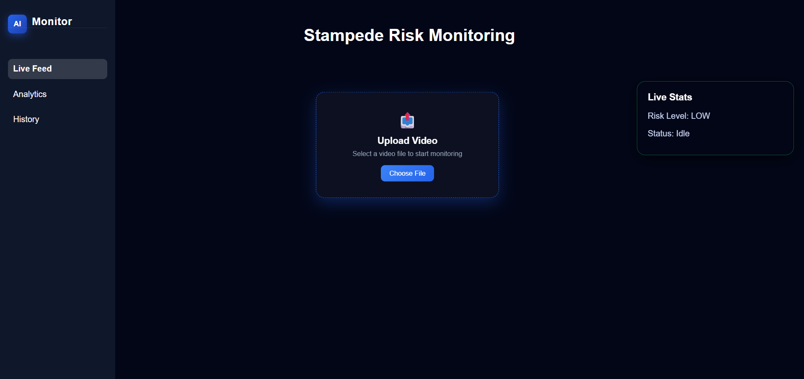
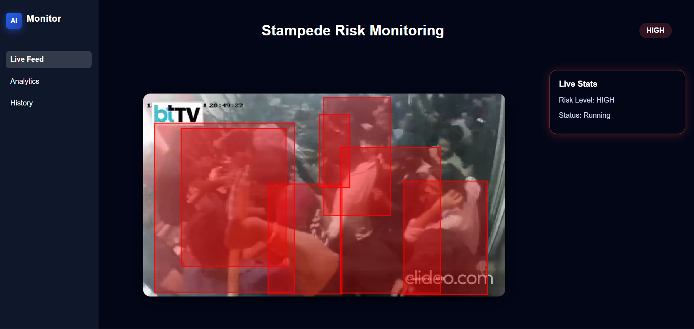
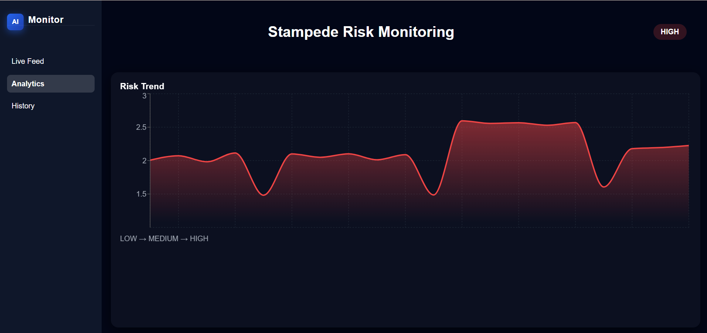
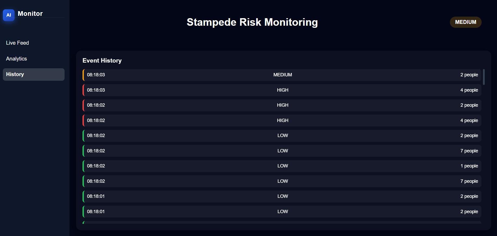

# AI-Based Stampede Risk Prediction System

## 🚨 Problem Statement

Large crowd gatherings such as festivals, concerts, and public events are highly prone to stampede incidents due to overcrowding and panic situations. Early detection of risky crowd behavior is crucial to prevent disasters and ensure public safety.

This project presents an AI-based system that analyzes crowd dynamics from video input and predicts potential stampede risk in real-time.

---

## 🧠 System Overview

The system processes video input and analyzes crowd behavior using computer vision and deep learning techniques.

**Pipeline:**

Video Input → Person Detection (YOLOv8) → Motion Analysis (Optical Flow) → Feature Extraction → Temporal Modeling (LSTM) → Risk Prediction → Alert System

---

## 🧩 Key Components

- **YOLOv8 Detector**: Detects individuals in crowd frames  
- **Optical Flow Module**: Captures motion intensity and direction  
- **Feature Engineering Layer**: Combines spatial + temporal features  
- **LSTM Model**: Predicts risk based on sequential crowd behavior  
- **Alert System**: Triggers warning when high-risk detected  

## ⚙️ Features

* Real-time crowd detection using YOLOv8
* Motion analysis using Optical Flow
* Temporal risk prediction using LSTM
* Risk classification: **Low / Medium / High**
* Alert system with sound notification
* Interactive frontend dashboard

---

## 🏗️ Design Considerations

- Separation of training and inference pipelines
- Lightweight backend for real-time processing
- Modular architecture for scalability
- Efficient frame buffering for temporal modeling

## 🧪 How It Works

1. User uploads a video through the frontend
2. Backend extracts frames using OpenCV
3. YOLO detects people and estimates crowd density
4. Optical flow analyzes crowd movement patterns
5. Features are passed into LSTM model
6. System predicts risk level (Low / Medium / High)
7. Alert sound is triggered for high-risk situations

---

## ⏱️ Processing Flow

- Frame Extraction: ~10–15 FPS  
- Detection + Feature Extraction: Real-time  
- Temporal Buffer: 30 frames  
- Prediction Interval: Every few seconds 

## 🖥️ Tech Stack

**Frontend:**

* React (Vite)
* Tailwind CSS

**Backend:**

* Flask
* Flask-SocketIO

**AI / ML:**

* YOLOv8 (Ultralytics)
* OpenCV
* PyTorch (LSTM)

**Data Processing:**

* NumPy
* Pandas
* Scikit-learn

---

## ▶️ How to Run

### Backend

cd backend
pip install -r requirements.txt
python app.py

### Frontend

cd frontend
npm install
npm run dev

---

## 📁 Project Structure

backend/        → API & inference logic
frontend/       → User interface
model/          → Training & research code
sample_data/    → Sample input video

---

## 📊 Output

* Risk Level: **Low / Medium / High**
* Real-time crowd monitoring
* Alert sound triggered for high risk

---
## 📊 Evaluation

- Tested on multiple crowd videos
- Correctly identifies high-density + chaotic motion scenarios
- Provides early warning before critical crowd congestion

## 📈 Model Behavior

- High crowd density + chaotic motion → High Risk  
- Moderate density + directional flow → Medium Risk  
- Sparse crowd + stable motion → Low Risk  

## 📸 Screenshots

(Add your screenshots here)

Example:

---

## ⚠️ Model Files

Trained model files are not included due to size limitations.

Download them from:
https://drive.google.com/drive/folders/14ys6bKcnXgfOK0dN0gtB8pdEpvQ0SsEp?usp=sharing

Place them inside:

backend/models/

---

## 🚀 Future Improvements

* Real-time CCTV integration
* Graph Neural Networks for crowd behavior modeling
* Edge deployment for smart surveillance systems

---

## 🌍 Real-World Applications

- Crowd monitoring in festivals and events  
- Railway stations and metro platforms  
- Stadium and concert safety  
- Smart city surveillance systems 

## 👤 Author

Developed as a final year project focused on AI-based crowd safety and risk prediction.

## 🎥 Demo

[Watch Demo Video](https://drive.google.com/file/d/1iSYnwc6YbNW0Ih481iEnbtJeSEdVWTLf/view?usp=sharing)